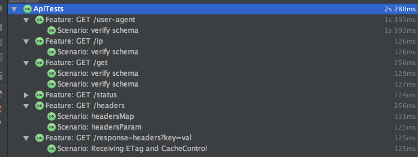
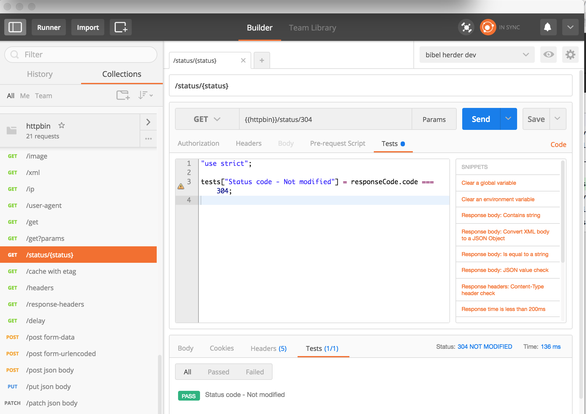
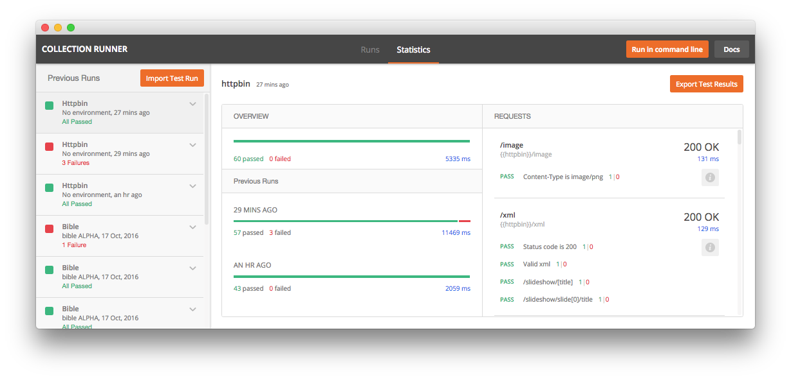

<!-- START doctoc generated TOC please keep comment here to allow auto update -->
<!-- DON'T EDIT THIS SECTION, INSTEAD RE-RUN doctoc TO UPDATE -->
**Table of Contents**  *generated with [DocToc](https://github.com/thlorenz/doctoc)*

- [httpplayground](#httpplayground)
  - [httpbin(1): HTTP Request & Response Service](#httpbin1-http-request-&-response-service)
  - [Ok-Retrofit](#ok-retrofit)
  - [Postman & newman](#postman-&-newman)

<!-- END doctoc generated TOC please keep comment here to allow auto update -->

httpplayground
========

httpbin(1): HTTP Request & Response Service
------   

See **http://httpbin.org/**

Testing an HTTP Library can become difficult sometimes. RequestBin is fantastic for testing POST requests, but doesn't let you control the response. This exists to cover all kinds of HTTP scenarios. Additional endpoints are being considered.

The requests can be made directly against the http://httpbin.org/ endpoint

Or the python/flask server can be run locally: [`$ start_localserver.sh`](start_localserver.sh)

Ok-Retrofit 
--------


In [`ok-retrofit/src/test/kotlin/ApiTests.kt`](ok-retrofit/src/test/kotlin/ApiTests.kt) we have calls to httpbin   

- http requests are built with http://square.github.io/okhttp/
- ... then retrofited to https://square.github.io/retrofit/
- ... then packed in a https://github.com/kotlintest/kotlintest test suite
- ... which can be run in a junit runner




Postman & newman
-------

A postman collection is provided that call the most important httpbin endpionts


The requests contains `Pre-request Script` and `Tests` written in javascript allowing to validate the response

The requests can be run either individually in Postman



Or via the Postman `Runner`
 


Or via the newman command-line: 


```bash
$ test_newman.sh

→ /image
  GET http://httpbin.org/image [200 OK, 10.53KB, 304ms]
  ✓  Content-Type is image/webp

→ /xml
  GET http://httpbin.org/xml [200 OK, 741B, 126ms]
  ✓  Status code is 200
  ✓  Valid xml
  ✓  /slideshow/[title]
  ✓  /slideshow/slide[0]/title

→ /ip
  GET http://httpbin.org/ip [200 OK, 251B, 125ms]
  ✓  Status code is 200
  ✓  Valid Json Schema

→ /user-agent
  GET http://httpbin.org/user-agent [200 OK, 262B, 125ms]
  ✓  Status code is 200
  ✓  Valid Json Schema

→ /get
  GET http://httpbin.org/get [200 OK, 456B, 123ms]
  ✓  Status code is 200
  ✓  Valid Json Schema
  ✓  Has no args

→ /get?params
  GET http://httpbin.org/get?id=1&gender=MALE [200 OK, 513B, 136ms]
  ✓  Status code is 200
  ✓  Valid Json Schema
  ✓  Has expected args

→ /status/{status}
  GET http://httpbin.org/status/304 [304 Not Modified, 177B, 123ms]
  ✓  Status code - Not modified

→ /cache with etag
  GET http://httpbin.org/cache [304 Not Modified, 177B, 145ms]
  ✓  Status code - Not modified

(...)

```


Junit and html reports are available under the directory `postman/newman`

